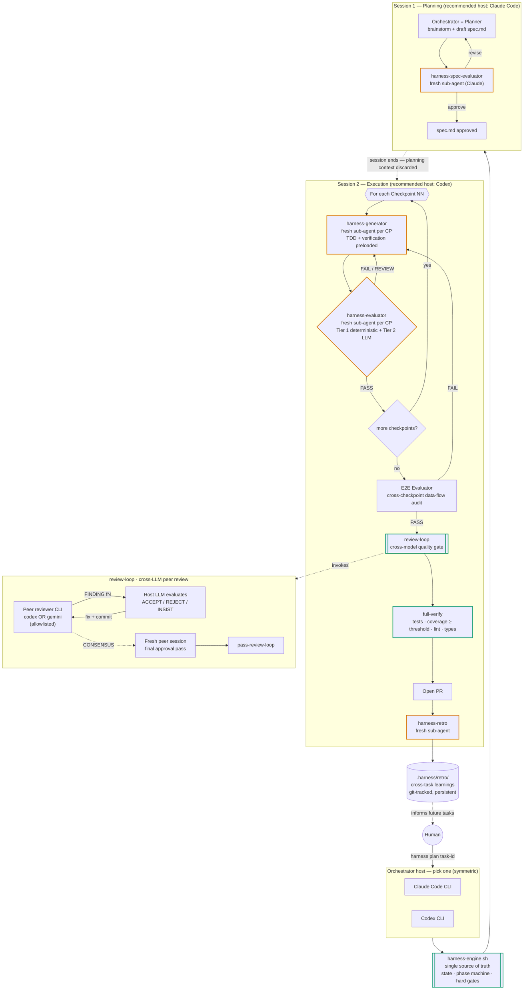

<p align="center"><a href="README.md">English</a> | <a href="README.zh-CN.md">中文</a></p>

# Harness Engineering Skills

> **Let an AI agent code for hours unattended — and ship PRs you'd actually merge.**
>
> Most autonomous coding loops drift after the first hour: context bloats, the model starts agreeing with itself, and "PASS" stops meaning anything. **Harness** turns Claude Code, Codex, and Gemini into a feedback-controlled runtime where the engine — not the LLM — owns the gates, every checkpoint runs against a fresh agent, and a different-vendor peer reviews before any PR opens.

[](https://opensource.org/licenses/Apache-2.0)
[](https://claude.ai/claude-code)
[](https://github.com/openai/codex)
[](https://github.com/google-gemini/gemini-cli)

## The pain you've probably felt

If you've actually tried autonomous coding agents on real work, you know how it ends:

- **Drift sets in fast.** Hour 1 is great. By hour 4 the agent is relitigating decisions, hallucinating filenames, and writing code that contradicts what it wrote earlier in the same session.
- **"PASS" doesn't mean PASS.** When the same model that wrote the code also grades the code, you can't trust the grade. Tests get silently skipped, coverage drops, and the model insists everything works.
- **Same-vendor review is an echo chamber.** Asking Claude to review Claude won't catch what Claude tends to miss. Same for Codex reviewing Codex.
- **Every task starts cold.** Lessons from yesterday's task vanish before today's task begins. Same mistakes, same week, every week.
- **"Autonomous" still needs babysitting.** Step away to make coffee, come back to find the agent stuck in a loop — or busy "improving" something you didn't ask for.

Multi-agent frameworks promise to fix all of this. Most ship demos.

## What Harness actually does

Harness is a Claude Code plugin (also runs inside Codex CLI) that wraps autonomous coding agents in a cybernetic feedback loop. Five mechanisms work together — each closes one of the failure modes above:

1. **The engine owns the gates, not the LLM.** A small Bash engine (`harness-engine.sh`) tracks state on disk and refuses to advance the phase machine unless the artifact on disk has the correct verdict. The LLM cannot self-certify a PASS — if `evaluation.md` doesn't say `verdict: PASS`, `pass-checkpoint` returns an error and the pipeline halts.
2. **Fresh context per checkpoint.** Each checkpoint spawns a brand-new sub-agent for both the Generator (writes the code) and the Evaluator (judges it). Drift cannot accumulate across checkpoints because the context literally resets. The engine even verifies that the evaluator's session id was never used by a prior checkpoint, so you can't reuse a stale evaluator to fake a pass.
3. **Plan and execute in separate sessions.** Planning lives in one process; execution lives in another. The execution session never sees the planning conversation, so it can't shortcut its own evaluation by remembering "well, the plan said this should work."
4. **Cross-vendor peer review before every PR.** When the task is otherwise done, a different vendor's CLI (`codex` or `gemini`) reads the diff and files structured findings. The host LLM debates back, makes the accepted fixes, re-submits — until both sides reach `CONSENSUS`. Then a *fresh* peer session does a final approval pass so the closing verdict isn't biased by the iterative repair conversation.
5. **Memory across tasks.** Every completed task ends with a retrospective committed to `.harness/retro/`. Error patterns accumulate. Rule proposals get drafted. The system genuinely learns over time — the only piece of state that ISN'T context-discarded, by design.

A bundled `phase-guard` PreToolUse hook also nudges you (advisory, doesn't hard-block) if you try to `git push` or `gh pr create` before the harness phase machine has reached `pr` — a soft safety net for the human in the loop.

The result: the agent runs unattended for hours (we routinely ship tasks that span 10+ hours of agent time across multiple sessions), every PASS is real, and the PR that lands at the end is one a senior engineer would approve without a rewrite.

## What's in the box

| Component | What it is |
|---|---|
| **Skill: `harness`** | Cybernetics-based Planner → Generator → Evaluator → Retro orchestration. Engine + phase machine + 4 reference protocols. |
| **Skill: `review-loop`** | Cross-LLM iterative code review. Auto-detects scope (local diff / branch / PR / specific commit), spawns peer (Codex or Gemini), iterates until `CONSENSUS`. Usable standalone — does not require the harness skill. |
| **4 sub-agents** | `harness-spec-evaluator`, `harness-generator`, `harness-evaluator`, `harness-retro` — fresh-context Claude sub-agents the engine dispatches per phase. |
| **`harness-engine.sh`** | Bash engine: state on disk (`.harness/<task>/`, `git-state.json`), phase machine, hard gates (`pass-checkpoint`, `pass-e2e`, `pass-review-loop`, `pass-full-verify`, `pass-pr`). |
| **`phase-guard.mjs`** | Optional Claude Code hook that warns on premature `git push` / `gh pr create` while a harness task is mid-flight. |
| **`preflight.sh` + `peer-invoke.sh`** | Review-loop scripts: scope detection, peer CLI launch with isolated `CODEX_HOME` and stripped credentials. |

## Workflow at a glance

Here's what runs when you say `harness plan <task-id>`. Orange-bordered nodes are **fresh-sub-agent drift firewalls**; green-bordered nodes are **engine-enforced gates** the LLM cannot bypass.



### Hosts and roles

The model running each role is decoupled from the model hosting the session — that's why the same pipeline works whether you start in Claude Code or Codex.

| Role | Who plays it | Notes |
|---|---|---|
| **Orchestrator host** (Session 1 + 2) | Claude Code CLI **or** Codex CLI | Symmetric. Recommended split: Claude Code for Session 1, Codex for Session 2. |
| **Spec Evaluator** | Claude (sub-agent or via `claude-agent-invoke.sh`) | Stable across hosts. |
| **Generator** | Active host LLM (Claude or Codex) | Inherits the host. |
| **Evaluator / E2E / Retro** | Claude (sub-agent or via `claude-agent-invoke.sh`) | Engine rejects same-context self-evaluation. |
| **`review-loop` peer** (cross-model gate) | `codex` CLI **or** `gemini` CLI — allowlisted | Claude is **not** a peer here by design — same-vendor review would defeat the cross-model purpose. |

> Heads-up on the peer allowlist: the bundled `review-loop` skill enforces `peer ∈ {codex, gemini}` in preflight. If Claude is hosting, the peer is naturally a different vendor; if Codex is hosting, picking `codex` still gives you a fresh isolated context (different `CODEX_HOME`, no MCP, stripped credentials), and `gemini` gives you a true cross-vendor read.

## What makes Harness different

| Concern | Typical multi-agent loop | This Harness skill |
|---|---|---|
| **Context drift** | One growing context across plan → code → review | Two-session split + fresh sub-agent per checkpoint (eigenbehavior reset) |
| **Self-certification** | LLM judges its own output | `harness-engine.sh` blocks `pass-checkpoint` until the latest `evaluation.md` has `verdict: PASS` **and** the evaluator session id was not reused by any prior checkpoint |
| **Echo-chamber review** | Same model reviews itself | `review-loop` enforces a different-vendor peer (Codex or Gemini) and runs a **fresh-session final approval pass** so the closing verdict isn't biased by the iterative repair conversation |
| **Black-box state** | State implicit in chat history | All state on disk (`.harness/<task-id>/`, `git-state.json`), one engine script owns the phase machine, every transition is auditable |
| **No memory across tasks** | Each task starts cold | Persistent `.harness/retro/` (git-tracked) accumulates error patterns, rule proposals, and skill defects — closes the cybernetic feedback loop |
| **Tool-use bias** | Lock-in to one CLI / one vendor | Orchestrator host and review peer are independently swappable; the same engine and gates run on Claude Code or Codex |

## Install

```bash
claude plugin marketplace add https://github.com/stone16/harness-engineering-skills
claude plugin install harness-engineering-skills@stometa
```

Verify:

```bash
claude plugin list | grep harness-engineering-skills
```

## Prerequisites

- **Required**: `git`, `python3`, Claude Code with the [`superpowers`](https://github.com/anthropics/claude-code) plugin installed.
- **Peer reviewer** (one of): [`codex` CLI](https://github.com/openai/codex) or [`gemini` CLI](https://github.com/google-gemini/gemini-cli) — only needed if you use `review-loop` or `harness`'s cross-model review.
- **Optional**: `gh` CLI for PR-scoped review detection.

## Usage

### `review-loop` (standalone)

Inside a Claude Code session, once the plugin is installed:

```
/review-loop
```

Variants: `review loop with gemini`, `review loop, max 3 rounds`, `review loop for PR 42`, `review loop for commit abc123`.

The peer reviewer is one of `codex` or `gemini` — set globally via `.review-loop/config.json` (`peer_reviewer`), or per-invocation. The loop iterates until peer and host reach `CONSENSUS`, then runs a fresh-session final approval pass before writing `summary.md`.

### `harness` (orchestrated task)

Two recommended entry patterns — both produce the identical pipeline shown in the diagram above:

**Pattern A — Claude Code drives planning, Codex drives execution (recommended):**

```
# Session 1, in Claude Code
harness plan <task-id>          # interactive spec creation + spec review

# Session 2, in Codex (fresh process, planning context discarded by design)
harness execute <task-id>       # checkpoints → E2E → review-loop → full-verify → PR → retro
```

**Pattern B — single host (Claude Code or Codex) for everything:**

```
harness plan <task-id>
harness continue                # same host runs both phases
```

Pick the cross-model peer once in `.harness/config.json`:

```json
{ "cross_model_review": true, "cross_model_peer": "gemini" }
```

`harness` will not let `pass-checkpoint`, `pass-e2e`, `pass-review-loop`, or `pass-full-verify` succeed unless the corresponding artifacts exist with the right verdict — the engine is the gatekeeper, not the LLM.

## License

Apache-2.0 — see [LICENSE](LICENSE).

## Origin and related

This repo is the public publication surface for a subset of [Stometa](https://github.com/stone16)'s private `stometa-skillset`. Future batches will add more skills as they stabilize. Issues and pull requests are welcome on the [GitHub tracker](https://github.com/stone16/harness-engineering-skills/issues).
