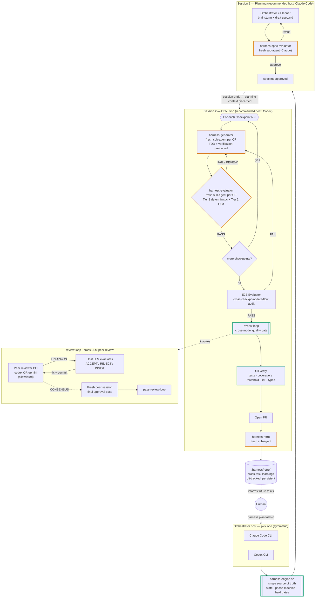

<p align="center"><a href="README.md">English</a> | <a href="README.zh-CN.md">中文</a></p>

# Harness Engineering Skills

Stometa's public curated Claude Code skillset — a small, opinionated set of skills we use ourselves, published periodically.

[](https://opensource.org/licenses/Apache-2.0)
[](https://claude.ai/claude-code)
[](https://github.com/openai/codex)
[](https://github.com/google-gemini/gemini-cli)

## Why this repo

This is the **public** companion to Stometa's private `stometa-skillset`. We dogfood a larger internal skillset day-to-day; selected skills are extracted, polished, and published here in batches. The goal is to share the workflows that actually hold up under real engineering work — not a pile of prototypes.

The first batch ships two skills: `review-loop` (already proven in daily use) and `harness` (multi-agent orchestration for larger tasks). Both are installable as a single Claude Code plugin.

## Workflow at a glance

`harness` is a cybernetics-inspired orchestrator: planning and execution live in **separate sessions** so context cannot leak; every checkpoint runs against a **fresh sub-agent** to reset eigenbehavior; an **engine script** owns state and enforces hard gates so the LLM cannot self-certify; and a **cross-model peer** (a different vendor's CLI) reviews before PR so you never merge on a single model's opinion. Persistent retro feeds learnings back into future tasks — that's the closing loop of the cybernetic system.



**Legend** — orange-bordered nodes are the **fresh-sub-agent** drift firewalls; green-bordered nodes are the **engine-enforced gates** that the LLM cannot bypass.

### Hosts and roles

The model running each role is decoupled from the model hosting the session — that's why the same pipeline works whether you start in Claude Code or Codex.

| Role | Who plays it | Notes |
|---|---|---|
| **Orchestrator host** (Session 1 + 2) | Claude Code CLI **or** Codex CLI | Symmetric. Recommended split: Claude Code for Session 1, Codex for Session 2. |
| **Spec Evaluator** | Claude (sub-agent or via `claude-agent-invoke.sh`) | Stable across hosts. |
| **Generator** | Active host LLM (Claude or Codex) | Inherits the host. |
| **Evaluator / E2E / Retro** | Claude (sub-agent or via `claude-agent-invoke.sh`) | Engine rejects same-context self-evaluation. |
| **`review-loop` peer** (cross-model gate) | `codex` CLI **or** `gemini` CLI — allowlisted | Claude is **not** a peer here by design — same-vendor review would defeat the cross-model purpose. |

> Heads-up on the peer allowlist: the bundled `review-loop` skill enforces `peer ∈ {codex, gemini}` in preflight. If Claude is hosting, the peer is naturally a different vendor; if Codex is hosting, picking `codex` still gives you a fresh isolated context (different `CODEX_HOME`, no MCP, stripped credentials), and `gemini` gives you a true cross-vendor read.

## What makes Harness different

| Concern | Typical multi-agent loop | This Harness skill |
|---|---|---|
| **Context drift** | One growing context across plan → code → review | Two-session split + fresh sub-agent per checkpoint (eigenbehavior reset) |
| **Self-certification** | LLM judges its own output | `harness-engine.sh` blocks `pass-checkpoint` until the latest `evaluation.md` has `verdict: PASS` **and** the evaluator session id was not reused by any prior checkpoint |
| **Echo-chamber review** | Same model reviews itself | `review-loop` enforces a different-vendor peer (Codex or Gemini) and runs a **fresh-session final approval pass** so the closing verdict isn't biased by the iterative repair conversation |
| **Black-box state** | State implicit in chat history | All state on disk (`.harness/<task-id>/`, `git-state.json`), one engine script owns the phase machine, every transition is auditable |
| **No memory across tasks** | Each task starts cold | Persistent `.harness/retro/` (git-tracked) accumulates error patterns, rule proposals, and skill defects — closes the cybernetic feedback loop |
| **Tool-use bias** | Lock-in to one CLI / one vendor | Orchestrator host and review peer are independently swappable; the same engine and gates run on Claude Code or Codex |

## Skills

### `review-loop`

Cross-LLM iterative code review. Spawns a peer reviewer (Codex CLI or Gemini CLI) to independently review your changes. Claude evaluates the peer's findings, implements accepted fixes, and re-submits until both sides agree on the final code state. The human doesn't need to participate — watch progress via `.review-loop/<session>/summary.md`.

### `harness`

Cybernetics-based multi-agent orchestration for complex tasks. Coordinates a **Planner → Generator → Evaluator → Retro** pipeline with fresh sub-agents per checkpoint (drift prevention) and persistent retro learning across tasks. Recommended flow: Claude Code plans the spec (Session 1), Codex executes autonomously (Session 2), and `review-loop` (Codex or Gemini CLI as peer) provides the cross-model quality gate before PR.

## Install

```bash
claude plugin marketplace add https://github.com/stone16/harness-engineering-skills
claude plugin install harness-engineering-skills@stometa
```

Verify:

```bash
claude plugin list | grep harness-engineering-skills
```

## Prerequisites

- **Required**: `git`, `python3`, Claude Code with the [`superpowers`](https://github.com/anthropics/claude-code) plugin installed.
- **Peer reviewer** (one of): [`codex` CLI](https://github.com/openai/codex) or [`gemini` CLI](https://github.com/google-gemini/gemini-cli) — only needed if you use `review-loop` or `harness`'s cross-model review.
- **Optional**: `gh` CLI for PR-scoped review detection.

## Usage

### `review-loop` (standalone)

Inside a Claude Code session, once the plugin is installed:

```
/review-loop
```

Variants: `review loop with gemini`, `review loop, max 3 rounds`, `review loop for PR 42`, `review loop for commit abc123`.

The peer reviewer is one of `codex` or `gemini` — set globally via `.review-loop/config.json` (`peer_reviewer`), or per-invocation. The loop iterates until peer and host reach `CONSENSUS`, then runs a fresh-session final approval pass before writing `summary.md`.

### `harness` (orchestrated task)

Two recommended entry patterns — both produce the identical pipeline shown in the diagram above:

**Pattern A — Claude Code drives planning, Codex drives execution (recommended):**

```
# Session 1, in Claude Code
harness plan <task-id>          # interactive spec creation + spec review

# Session 2, in Codex (fresh process, planning context discarded by design)
harness execute <task-id>       # checkpoints → E2E → review-loop → full-verify → PR → retro
```

**Pattern B — single host (Claude Code or Codex) for everything:**

```
harness plan <task-id>
harness continue                # same host runs both phases
```

Pick the cross-model peer once in `.harness/config.json`:

```json
{ "cross_model_review": true, "cross_model_peer": "gemini" }
```

`harness` will not let `pass-checkpoint`, `pass-e2e`, `pass-review-loop`, or `pass-full-verify` succeed unless the corresponding artifacts exist with the right verdict — the engine is the gatekeeper, not the LLM.

## License

Apache-2.0 — see [LICENSE](LICENSE).

## Origin and related

This repo is the public publication surface for a subset of [Stometa](https://github.com/stone16)'s private `stometa-skillset`. Future batches will add more skills as they stabilize. Issues and pull requests are welcome on the [GitHub tracker](https://github.com/stone16/harness-engineering-skills/issues).
