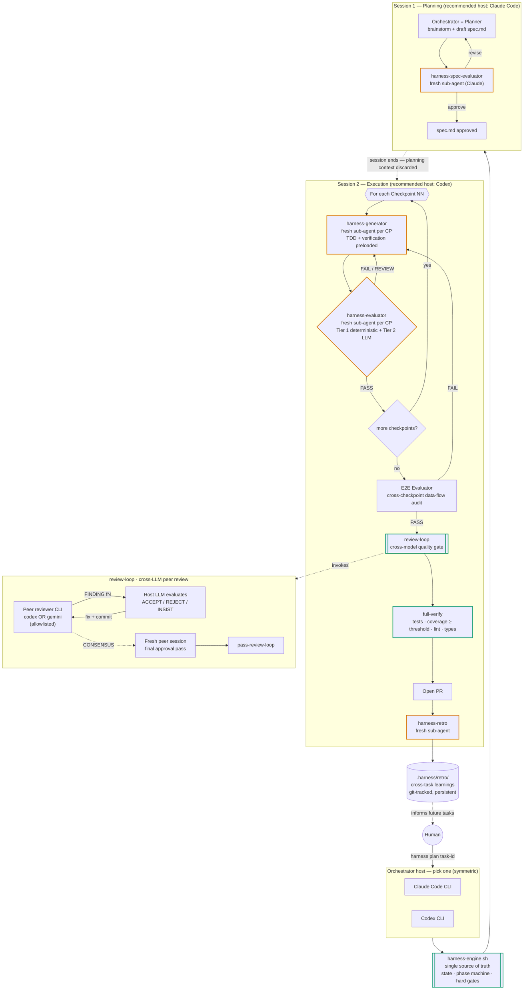

<p align="center"><a href="README.md">English</a> | <a href="README.zh-CN.md">中文</a></p>

# Harness 工程化技能集

Stometa 对外公开的 Claude Code 精选技能集 —— 一套我们自己每天在用、并按批次对外发布的小而克制的技能。

[](https://opensource.org/licenses/Apache-2.0)
[](https://claude.ai/claude-code)
[](https://github.com/openai/codex)
[](https://github.com/google-gemini/gemini-cli)

## 这个仓库是什么

本仓库是 Stometa 私有仓库 `stometa-skillset` 的**公开**伴随版本。我们在内部使用一套更大的技能集；经过打磨验证的技能会被挑选出来，定期以批次的形式发布到这里。目标是把真正能扛住日常工程工作的工作流分享出来，而不是堆砌一堆原型。

第一批发布两个技能：`review-loop`（日常已经在用）和 `harness`（面向复杂任务的多智能体编排）。两者作为同一个 Claude Code 插件安装。

## 工作流总览

`harness` 是一套受控制论（cybernetics）启发的编排器：**规划与执行被强制拆到两个会话**，上下文不会串味；**每个 checkpoint 都用全新的子智能体**重置 eigenbehavior；一个**引擎脚本**独占状态并强制硬闸门，LLM 无法自我盖章；产 PR 之前必须经过一次**跨模型同行评审**（不同厂商的 CLI），不会基于单模型意见就合入。每次任务的复盘会持久化下来反哺后续任务 —— 这就是这套控制论系统的闭环。



**图例** —— 橙色描边的节点是**全新子智能体**形成的"防漂移防火墙"；绿色描边的节点是 LLM 无法绕开的**引擎硬闸门**。

### 角色与宿主对照

每个角色由谁来扮演，与会话宿主是哪个 LLM 解耦 —— 这正是同一套流水线在 Claude Code 起手和在 Codex 起手都能跑通的原因。

| 角色 | 由谁扮演 | 说明 |
|---|---|---|
| **编排宿主**（Session 1 + 2） | Claude Code CLI **或** Codex CLI | 对称可换。推荐拆法：Session 1 用 Claude Code，Session 2 用 Codex。 |
| **Spec Evaluator** | Claude（子智能体或通过 `claude-agent-invoke.sh`） | 跨宿主稳定不变。 |
| **Generator** | 当前宿主 LLM（Claude 或 Codex） | 跟随宿主。 |
| **Evaluator / E2E / Retro** | Claude（子智能体或通过 `claude-agent-invoke.sh`） | 引擎拒绝同上下文自评。 |
| **`review-loop` peer**（跨模型闸门） | `codex` CLI **或** `gemini` CLI —— 白名单限定 | Claude **不**作为这里的 peer，这是有意为之 —— 同厂商互评违背"跨模型"初衷。 |

> 关于 peer 白名单的提醒：`review-loop` 在 preflight 阶段强制 `peer ∈ {codex, gemini}`。如果宿主是 Claude，peer 自然是另一家厂商；如果宿主是 Codex，选 `codex` 也能拿到一个全新隔离的上下文（独立 `CODEX_HOME`、关闭 MCP、剥离凭证），选 `gemini` 则是真正的跨厂商交叉读。

## 这套 Harness 与常见多智能体方案的差异

| 关注点 | 常见多智能体回路 | 本仓库的 Harness |
|---|---|---|
| **上下文漂移** | 规划 → 编码 → 评审共用一个不断膨胀的上下文 | 双会话拆分 + 每个 checkpoint 全新子智能体（eigenbehavior 重置） |
| **自我盖章** | LLM 给自己产出的代码下结论 | `harness-engine.sh` 在最新 `evaluation.md` 不是 `verdict: PASS`、且 evaluator session id 与历史 checkpoint 重复时，直接拒绝 `pass-checkpoint` |
| **回音壁式评审** | 同模型自评自审 | `review-loop` 强制 peer 来自不同厂商（Codex 或 Gemini），并在最终通过前用**全新会话**做一次终审，避免被迭代修复中的对话偏置 |
| **黑盒状态** | 状态隐式藏在聊天上下文里 | 全部状态落盘（`.harness/<task-id>/`、`git-state.json`），单一引擎脚本掌管阶段机，每次状态迁移都可审计 |
| **任务间无记忆** | 每个任务从零开始 | 持久化的 `.harness/retro/`（纳入 git）累积错误模式、规则提案、技能缺陷 —— 闭合控制论反馈环 |
| **工具锁定** | 强绑定单一 CLI / 单一厂商 | 编排宿主和评审 peer 各自可换；同一套引擎和闸门在 Claude Code 与 Codex 上都能跑 |

## 技能清单

### `review-loop`

跨 LLM 的迭代式代码审查。调用一个同行审查者（Codex CLI 或 Gemini CLI）独立审查你的改动，Claude 评估对方的发现，采纳后实现修复并重新提交审查，直到双方对最终代码状态达成一致。审查过程不需要你参与，可以通过 `.review-loop/<session>/summary.md` 查看进展。

### `harness`

面向复杂任务的、基于控制论（cybernetics）的多智能体编排。它把任务驱动成一条 **Planner → Generator → Evaluator → Retro** 流水线，每个 checkpoint 使用全新的子智能体（防漂移），并跨任务持续沉淀复盘经验。推荐流程：Session 1 用 Claude Code 规划 spec，Session 2 用 Codex 自主执行，然后通过 `review-loop`（Codex 或 Gemini CLI 作为 peer）完成发 PR 前的跨模型质量门禁。

## 安装

```bash
claude plugin marketplace add https://github.com/stone16/harness-engineering-skills
claude plugin install harness-engineering-skills@stometa
```

验证安装：

```bash
claude plugin list | grep harness-engineering-skills
```

## 前置条件

- **必需**：`git`、`python3`，以及已安装 [`superpowers`](https://github.com/anthropics/claude-code) 插件的 Claude Code。
- **同行审查者**（任选其一）：[`codex` CLI](https://github.com/openai/codex) 或 [`gemini` CLI](https://github.com/google-gemini/gemini-cli) —— 仅在使用 `review-loop` 或 `harness` 的跨模型审查时需要。
- **可选**：`gh` CLI，用于按 PR 范围检测审查上下文。

## 使用

### `review-loop`（独立使用）

插件安装好后，在 Claude Code 会话里：

```
/review-loop
```

变体：`review loop with gemini`、`review loop, max 3 rounds`、`review loop for PR 42`、`review loop for commit abc123`。

Peer 评审者只能是 `codex` 或 `gemini` —— 通过 `.review-loop/config.json` 中的 `peer_reviewer` 全局配置，或在调用时按需覆盖。回路会持续迭代直到 peer 与宿主达成 `CONSENSUS`，再用一个全新会话做终审，最后才写入 `summary.md`。

### `harness`（编排任务）

两种推荐入口 —— 都对应上方流程图里同一条流水线：

**模式 A —— Claude Code 负责规划，Codex 负责执行（推荐）：**

```
# Session 1，在 Claude Code 中
harness plan <task-id>          # 交互式产出 spec 并完成 spec 评审

# Session 2，在 Codex 中（全新进程，规划上下文按设计被丢弃）
harness execute <task-id>       # checkpoints → E2E → review-loop → full-verify → PR → retro
```

**模式 B —— 单一宿主（Claude Code 或 Codex）跑完整流程：**

```
harness plan <task-id>
harness continue                # 同一宿主跑完两个阶段
```

跨模型 peer 在 `.harness/config.json` 里一次性指定：

```json
{ "cross_model_review": true, "cross_model_peer": "gemini" }
```

只要对应产物缺失或裁决不是 PASS，`harness` 就不会让 `pass-checkpoint`、`pass-e2e`、`pass-review-loop`、`pass-full-verify` 通过 —— 守门人是引擎，不是 LLM。

## 许可证

Apache-2.0 —— 详见 [LICENSE](LICENSE)。

## 来源与相关项目

本仓库是 [Stometa](https://github.com/stone16) 私有 `stometa-skillset` 部分技能的公开发布窗口。后续批次会在更多技能成熟后继续发布。Issue 和 PR 欢迎提到 [GitHub tracker](https://github.com/stone16/harness-engineering-skills/issues)。
