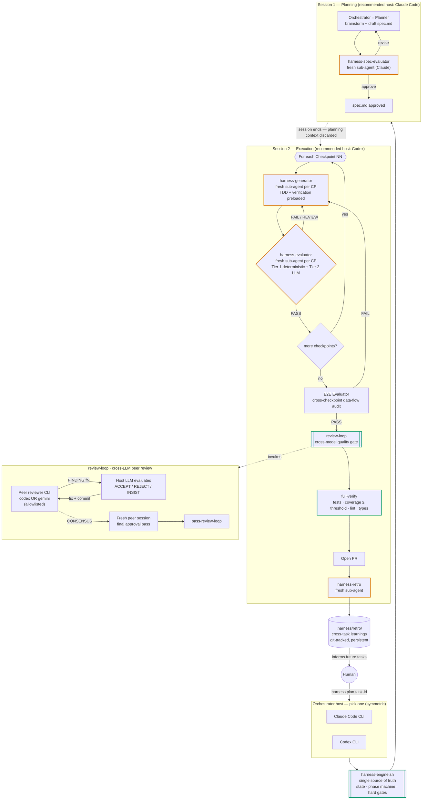

<p align="center"><a href="README.md">English</a> | <a href="README.zh-CN.md">中文</a></p>

# Harness 工程化技能集

> **让 AI Agent 连续无人值守写代码几个小时，最后产出能直接 merge 的 PR。**
>
> 大多数自主编码回路撑不过第一个小时：上下文越积越乱，模型开始顺着自己说话，"PASS" 也不再是 PASS。**Harness** 把 Claude Code、Codex、Gemini 编织进一套带反馈控制的运行时：闸门由引擎而不是 LLM 把守，每个 checkpoint 都跑在全新的 Agent 上，每个 PR 上线之前必须由不同厂商的 peer 过一遍。

[](https://opensource.org/licenses/Apache-2.0)
[](https://claude.ai/claude-code)
[](https://github.com/openai/codex)
[](https://github.com/google-gemini/gemini-cli)

## 你大概也踩过这些坑

如果你在真实项目里跑过自主编码 Agent，下面这些场景应该都不陌生：

- **Agent 很快就开始漂移。** 第 1 小时一切顺利，第 4 小时它已经开始反复推翻自己的决定、瞎编不存在的文件名、写出和自己上文互相矛盾的代码。
- **"PASS" 根本不等于 PASS。** 让写代码的同一个模型再来给自己的代码打分，得到的分根本不可信：测试被悄悄跳过，覆盖率默默掉下去，模型却信誓旦旦地说"一切正常"。
- **同厂商互评就是回音壁。** 让 Claude 评审 Claude 写的代码，根本抓不住 Claude 自己的盲点；Codex 评审 Codex 也是同样的问题。
- **每个新任务都从零开始。** 昨天踩过的坑，今天的 Agent 完全不知道。同样的错每周犯一遍。
- **"自主"还是离不开人盯着。** 起身倒杯咖啡的工夫回来，Agent 要么卡在死循环里，要么正在"优化"一些你根本没让它动的东西。

多智能体框架号称能解决这些。大多数只能跑出 demo。

## Harness 到底做了什么

Harness 是一个 Claude Code 插件（同时也能在 Codex CLI 里跑），它把自主编码 Agent 包裹在一套控制论反馈环里。五个机制各管一道防线 —— 一一对应上面那些痛点：

1. **闸门由引擎把守，不是 LLM。** 一个不大的 Bash 引擎（`harness-engine.sh`）在磁盘上记录状态，盘上产物没拿到正确裁决，阶段机就不放行。LLM 没办法给自己盖章 —— 只要 `evaluation.md` 不是 `verdict: PASS`，`pass-checkpoint` 就直接报错把流水线掐断。
2. **每个 checkpoint 都换全新上下文。** 每个 checkpoint 都会拉起一个全新的子 Agent 同时担任 Generator（写代码）和 Evaluator（判代码）。漂移没法跨 checkpoint 累积，因为上下文是物理重置的。引擎甚至会校验 evaluator 的 session id 没有被任何历史 checkpoint 用过，防止你拿过期的 evaluator 假装通过。
3. **规划和执行强制拆成两个会话。** 规划在一个进程里，执行在另一个进程里。执行会话从来看不到规划阶段的对话，所以它没办法靠"反正规划阶段说这样就行"来糊弄自己的评估。
4. **每个 PR 上线之前都要跨厂商 peer review。** 任务收尾时，另一家厂商的 CLI（`codex` 或 `gemini`）会读 diff 并给出结构化 finding。宿主 LLM 反驳、修改、重交，直到双方达成 `CONSENSUS`。然后**再开一个全新会话**做终审，避免最终裁决被前面来回讨论的对话偏置。
5. **跨任务的记忆。** 每个任务结束都会写一份 retro 提交进 `.harness/retro/`。错误模式会沉淀，规则改进提案会被起草。整个系统会真正越用越聪明 —— 这是这套设计里**唯一**不被"上下文丢弃"原则覆盖的状态，是有意为之。

另外还附带一个 `phase-guard` PreToolUse hook：当 harness 任务还没走到 `pr` 阶段你就想 `git push` 或 `gh pr create` 时，它会出来提醒你（只是建议性提示，不会硬拦），算是给"人在回路"留的一道软安全网。

最终效果：Agent 可以无人值守跑几个小时（我们日常会跑跨多个会话、累计 10 小时以上 Agent 时间的任务），每一次 PASS 都是真的 PASS，最终落到代码库的那个 PR，是高级工程师不会要求重写就能批的那种。

## 包里都装了什么

| 组件 | 是什么 |
|---|---|
| **Skill: `harness`** | 基于控制论的 Planner → Generator → Evaluator → Retro 编排。引擎 + 阶段机 + 4 份协议参考文档。 |
| **Skill: `review-loop`** | 跨 LLM 的迭代式代码审查。自动识别审查范围（本地 diff / 分支 / PR / 指定 commit），拉起 peer（Codex 或 Gemini）一直迭代到 `CONSENSUS`。可独立使用，不依赖 harness。 |
| **4 个子 Agent** | `harness-spec-evaluator`、`harness-generator`、`harness-evaluator`、`harness-retro` —— 引擎按阶段调度的全新上下文 Claude 子 Agent。 |
| **`harness-engine.sh`** | Bash 引擎：状态全部落盘（`.harness/<task>/`、`git-state.json`），独占阶段机，硬闸门（`pass-checkpoint`、`pass-e2e`、`pass-review-loop`、`pass-full-verify`、`pass-pr`）。 |
| **`phase-guard.mjs`** | 可选的 Claude Code hook：在 harness 任务还没走完时，如果你尝试 `git push` 或 `gh pr create`，它会出来提醒。 |
| **`preflight.sh` + `peer-invoke.sh`** | review-loop 的脚本：识别审查范围、用隔离的 `CODEX_HOME` 启动 peer CLI 并剥离继承的凭证。 |

## 工作流总览

下面这张图是你说一句 `harness plan <task-id>` 之后实际会跑的全部环节。橙色描边的节点是**全新子 Agent 形成的"防漂移防火墙"**；绿色描边的节点是 LLM 无法绕开的**引擎硬闸门**。



### 角色与宿主对照

每个角色由谁来扮演，与会话宿主是哪个 LLM 解耦 —— 这正是同一套流水线在 Claude Code 起手和在 Codex 起手都能跑通的原因。

| 角色 | 由谁扮演 | 说明 |
|---|---|---|
| **编排宿主**（Session 1 + 2） | Claude Code CLI **或** Codex CLI | 对称可换。推荐拆法：Session 1 用 Claude Code，Session 2 用 Codex。 |
| **Spec Evaluator** | Claude（子智能体或通过 `claude-agent-invoke.sh`） | 跨宿主稳定不变。 |
| **Generator** | 当前宿主 LLM（Claude 或 Codex） | 跟随宿主。 |
| **Evaluator / E2E / Retro** | Claude（子智能体或通过 `claude-agent-invoke.sh`） | 引擎拒绝同上下文自评。 |
| **`review-loop` peer**（跨模型闸门） | `codex` CLI **或** `gemini` CLI —— 白名单限定 | Claude **不**作为这里的 peer，这是有意为之 —— 同厂商互评违背"跨模型"初衷。 |

> 关于 peer 白名单的提醒：`review-loop` 在 preflight 阶段强制 `peer ∈ {codex, gemini}`。如果宿主是 Claude，peer 自然是另一家厂商；如果宿主是 Codex，选 `codex` 也能拿到一个全新隔离的上下文（独立 `CODEX_HOME`、关闭 MCP、剥离凭证），选 `gemini` 则是真正的跨厂商交叉读。

## 这套 Harness 与常见多智能体方案的差异

| 关注点 | 常见多智能体回路 | 本仓库的 Harness |
|---|---|---|
| **上下文漂移** | 规划 → 编码 → 评审共用一个不断膨胀的上下文 | 双会话拆分 + 每个 checkpoint 全新子智能体（eigenbehavior 重置） |
| **自我盖章** | LLM 给自己产出的代码下结论 | `harness-engine.sh` 在最新 `evaluation.md` 不是 `verdict: PASS`、且 evaluator session id 与历史 checkpoint 重复时，直接拒绝 `pass-checkpoint` |
| **回音壁式评审** | 同模型自评自审 | `review-loop` 强制 peer 来自不同厂商（Codex 或 Gemini），并在最终通过前用**全新会话**做一次终审，避免被迭代修复中的对话偏置 |
| **黑盒状态** | 状态隐式藏在聊天上下文里 | 全部状态落盘（`.harness/<task-id>/`、`git-state.json`），单一引擎脚本掌管阶段机，每次状态迁移都可审计 |
| **任务间无记忆** | 每个任务从零开始 | 持久化的 `.harness/retro/`（纳入 git）累积错误模式、规则提案、技能缺陷 —— 闭合控制论反馈环 |
| **工具锁定** | 强绑定单一 CLI / 单一厂商 | 编排宿主和评审 peer 各自可换；同一套引擎和闸门在 Claude Code 与 Codex 上都能跑 |

## 安装

```bash
claude plugin marketplace add https://github.com/stone16/harness-engineering-skills
claude plugin install harness-engineering-skills@stometa
```

验证安装：

```bash
claude plugin list | grep harness-engineering-skills
```

## 前置条件

- **必需**：`git`、`python3`，以及已安装 [`superpowers`](https://github.com/anthropics/claude-code) 插件的 Claude Code。
- **同行审查者**（任选其一）：[`codex` CLI](https://github.com/openai/codex) 或 [`gemini` CLI](https://github.com/google-gemini/gemini-cli) —— 仅在使用 `review-loop` 或 `harness` 的跨模型审查时需要。
- **可选**：`gh` CLI，用于按 PR 范围检测审查上下文。

## 使用

### `review-loop`（独立使用）

插件安装好后，在 Claude Code 会话里：

```
/review-loop
```

变体：`review loop with gemini`、`review loop, max 3 rounds`、`review loop for PR 42`、`review loop for commit abc123`。

Peer 评审者只能是 `codex` 或 `gemini` —— 通过 `.review-loop/config.json` 中的 `peer_reviewer` 全局配置，或在调用时按需覆盖。回路会持续迭代直到 peer 与宿主达成 `CONSENSUS`，再用一个全新会话做终审，最后才写入 `summary.md`。

### `harness`（编排任务）

两种推荐入口 —— 都对应上方流程图里同一条流水线：

**模式 A —— Claude Code 负责规划，Codex 负责执行（推荐）：**

```
# Session 1，在 Claude Code 中
harness plan <task-id>          # 交互式产出 spec 并完成 spec 评审

# Session 2，在 Codex 中（全新进程，规划上下文按设计被丢弃）
harness execute <task-id>       # checkpoints → E2E → review-loop → full-verify → PR → retro
```

**模式 B —— 单一宿主（Claude Code 或 Codex）跑完整流程：**

```
harness plan <task-id>
harness continue                # 同一宿主跑完两个阶段
```

跨模型 peer 在 `.harness/config.json` 里一次性指定：

```json
{ "cross_model_review": true, "cross_model_peer": "gemini" }
```

只要对应产物缺失或裁决不是 PASS，`harness` 就不会让 `pass-checkpoint`、`pass-e2e`、`pass-review-loop`、`pass-full-verify` 通过 —— 守门人是引擎，不是 LLM。

## 许可证

Apache-2.0 —— 详见 [LICENSE](LICENSE)。

## 来源与相关项目

本仓库是 [Stometa](https://github.com/stone16) 私有 `stometa-skillset` 部分技能的公开发布窗口。后续批次会在更多技能成熟后继续发布。Issue 和 PR 欢迎提到 [GitHub tracker](https://github.com/stone16/harness-engineering-skills/issues)。
